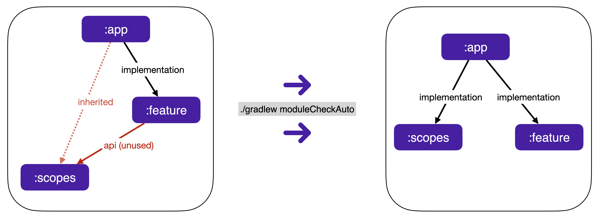

[](https://search.maven.org/search?q=com.rickbusarow.modulecheck)
[](https://plugins.gradle.org/plugin/com.rickbusarow.module-check)
[](https://oss.sonatype.org/#nexus-search;quick~com.rickbusarow.modulecheck)
[](https://opensource.org/licenses/Apache-2.0)


### This is a work in progress, in a very early state, and there are bugs.

___

ModuleCheck identifies unused **internal** (sub-project) dependencies within a Gradle project.

It does this **without performing a build**, which makes the parsing extremely fast.

All inspection is done using Gradle build files, Java/Kotlin source, and `res` xml files for Kotlin.

Documentation is at [https://rickbusarow.github.io/ModuleCheck](https://rbusarow.github.io/ModuleCheck/).

For snapshots, use the "next" version for documentation: https://rickbusarow.github.io/ModuleCheck/docs/next/



### Config
```kotlin
// settings.gradle.kts

pluginManagement {
  repositories {
    gradlePluginPortal()
    // Add for SNAPSHOT builds
    maven("https://oss.sonatype.org/content/repositories/snapshots/")
  }
}
```

<!--doks modulecheck-plugin-stable:1-->
```kotlin
// top-level build.gradle.kts

plugins {
  id("com.rickbusarow.module-check") version "0.12.5"
}
```
<!--doks END-->

### Tasks

all checks
```shell
./gradlew moduleCheck
```
all checks with auto-correct
```shell
./gradlew moduleCheckAuto
```

## License

``` text
Copyright (C) 2021-2023 Rick Busarow
Licensed under the Apache License, Version 2.0 (the "License");
you may not use this file except in compliance with the License.
You may obtain a copy of the License at
     https://www.apache.org/licenses/LICENSE-2.0
Unless required by applicable law or agreed to in writing, software
distributed under the License is distributed on an "AS IS" BASIS,
WITHOUT WARRANTIES OR CONDITIONS OF ANY KIND, either express or implied.
See the License for the specific language governing permissions and
limitations under the License.
```
