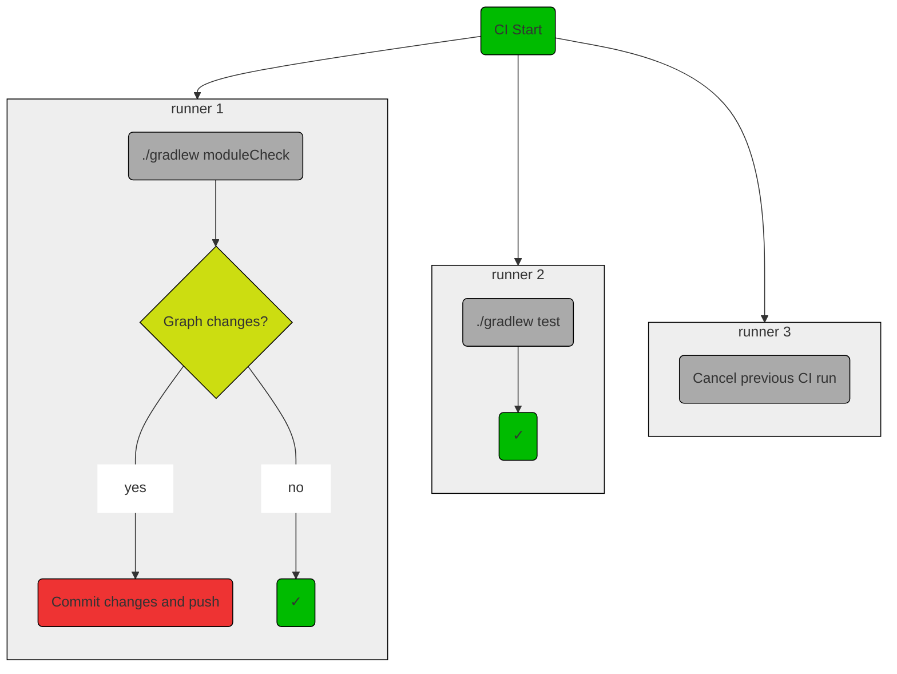

ModuleCheck will automatically fix most issues. Most CI platforms are able to commit changes, and
automatically cancel out-of-date jobs when the branch has been updated. This tooling can be used to
apply ModuleCheck's automatic fixes (if any) as part of a CI run, then cancel and start a new run.
This is similar to a git pre-commit hook, except the work is delegated to a build server.

### Using CI over git hooks

The traditional method for applying changes automatically is with a git hook, such as pre-commit or
pre-push. But if the task-to-be-automated has a runtime of more than a few seconds, this is a poor
developer experience. With a CI task, the execution is done automatically and asynchronously, while
the developer is already moving on to something else.

A git hook also technically doesn't guarantee that a task is executed before code is checked in to a
main branch, since there's no guarantee that a hook is enabled. With CI, the task will output a
status check. If a branch protection rule is enabled, that status check can be required. This will
then guarantee that the task has run (successfully) before any code is checked in to the protected
branch.

### Example Flow chart

This is a simplified flowchart of how I would run ModuleCheck with unit tests in CI. The
cancellation, test, and ModuleCheck jobs run in parallel on three different runners. This is an
"optimistic" workflow, in that it assumes that the `modulecheck` task will not generate changes
which would trigger a restart.



### Example GitHub Action

Here's an Action which will run ModuleCheck, then commit any changes
using [Stefanzweifel's auto-commit](https://github.com/stefanzweifel/git-auto-commit-action). This
requires a personal access token secret, or the commit step will fail.

```yaml title=.github/workflows.module-check.yml
name: ModuleCheck

on:
  pull_request:

jobs:

  cancel-stale-jobs:
    name: Cancel stale jobs
    runs-on: ubuntu-latest

    steps:
      # cancel previous jobs
      - name: Cancel Previous Runs
        uses: styfle/cancel-workflow-action@0.9.0
        env:
          GITHUB_TOKEN: '${{ secrets.GITHUB_TOKEN }}'

  ModuleCheck:
    name: ModuleCheck
    runs-on: ubuntu-latest

    steps:
      - uses: actions/checkout@v2
        with:
          ref: ${{ github.event.pull_request.head.ref }}
          # Must use a personal access token in order to commit changes
          token: ${{ secrets.PERSONAL_ACCESS_TOKEN }}
          fetch-depth: 0

      - name: Set up JDK
        uses : actions/setup-java@v2
        with :
          distribution : 'temurin'
          java-version : '11'

      # performs tree-shaking on the Gradle dependency graph
      - name: modulecheck
        run: ./gradlew modulecheck --no-daemon

      # If ModuleCheck generated changes, commit and push those changes.
      # If there are no changes, then this is a no-op.
      - name: commit changes
        uses: stefanzweifel/git-auto-commit-action@v4
        with:
          commit_message: Apply ModuleCheck changes
          commit_options: '--no-verify --signoff'

  tests:
    name: Unit tests
    runs-on: ubuntu-latest

    steps:
      - uses: actions/checkout@v2
        with:
          ref: ${{ github.event.pull_request.head.ref }}
          token: ${{ secrets.GITHUB_TOKEN }}
          fetch-depth: 0

      - name: Set up JDK
        uses : actions/setup-java@v2
        with :
          distribution : 'temurin'
          java-version : '14'

      - name: all tests
        run: ./gradlew test --no-daemon
```
