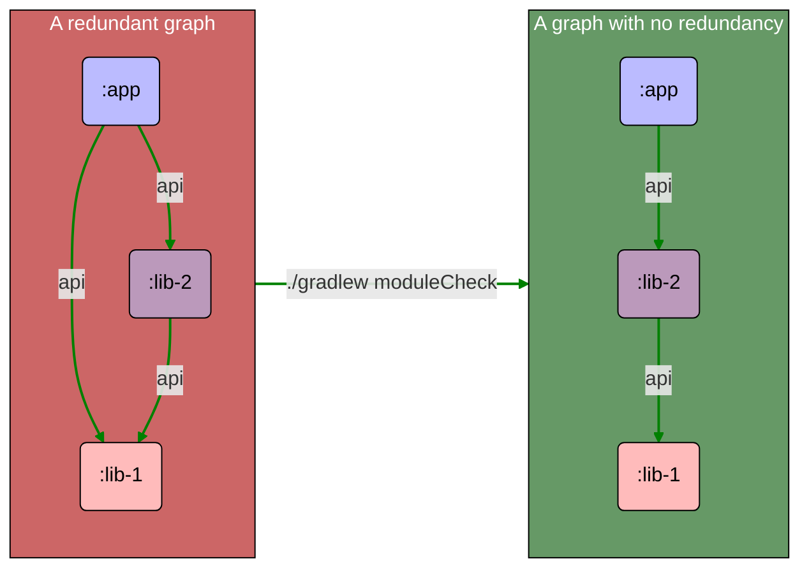

:::caution

This rule creates a brittle dependency graph, because some necessary dependencies are only provided
transitively by other dependencies. Any manual changes to dependencies can have unexpected
consequences downstream.

This rule is **not recommended** and disabled by default, but it's still available for those who
want to keep their build files as small as possible.

:::

Finds project dependencies which are declared as `api` in other dependency projects, but also
declared in the current project. These dependencies can be removed without actually breaking the
build, since they're still provided by an upstream dependency through the `api` configuration.

This is the opposite of the [inherited dependency] rule, which ensures a stable graph by explicitly
declaring each dependency. [Inherited dependency] is enabled by default, and is the recommended
approach. Both rules may not be enabled at the same time.

[Inherited dependency]:inherited_dependency.md
