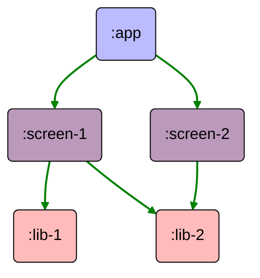
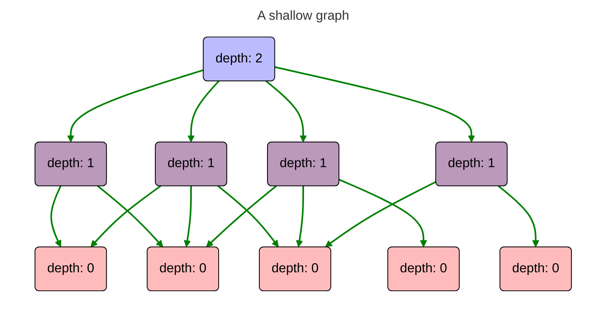
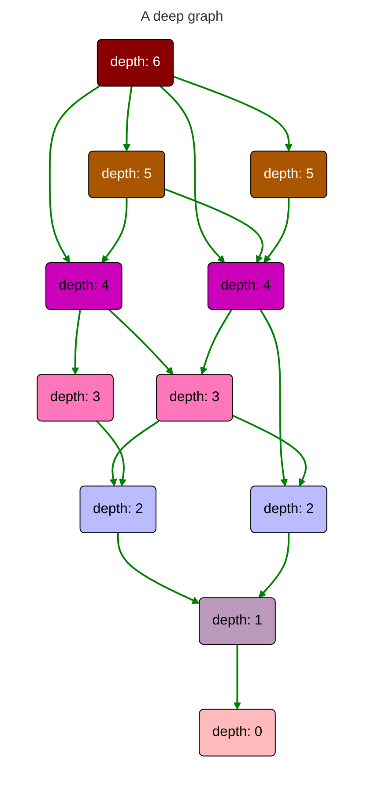

TL;DR - Low depth values mean faster builds and better all-around scalability.

---

It's often useful to think of module dependencies as a directed tree
or [directed acyclic graph](https://en.wikipedia.org/wiki/Directed_acyclic_graph). If a module is a
node, then each module dependency is a child node, and the dependencies of those dependencies are
grand-child nodes.

This is especially useful when thinking about **build performance**, because the parent-child
relationship is clear: _child nodes must build before parent nodes_.

In the above example,

- `:lib-1` and `:lib-2` must be built before `:screen-1`.
- `:lib-2` must be build before `:screen-2`.
- `:screen-1` and `:screen-2` must be built before `:app`.

It's worth pointing out that this relationship is recursive, as well. Grand-child nodes must build
before their parents.

### Dependencies and Build Concurrency

Individual module builds are always done single-threaded, but multiple modules may build in parallel
so long as no module in the set depends upon another module in that set. In the above graph,

- `:lib-1` and `:lib-2` may build in parallel
- `:lib-1` and `:screen-2` may build in parallel
- `:scren-1` and `:screen-2` may build in parallel

The maximum number of parallel module builds is determined by the structure of the dependency graph
and the number of available processor cores on the machine which is performing the build.

### Depth

**Depth** refers to the maximum number of edges between a module and each of its leaf nodes in the
project dependency graph.

Low depth values indicate a shallow or flat project structure with loose (or no) coupling between
modules. In a full build, these projects scale well with hardware upgrades because they're able to
build all those independent modules in parallel.

On the other hand, "deep" projects do not offer many opportunities for parallelization. They have
project dependencies which must be built *sequentially*. They also perform poorly in incremental
builds, because a single change to even a mid-level module invalidates cached builds for half of the
project.

